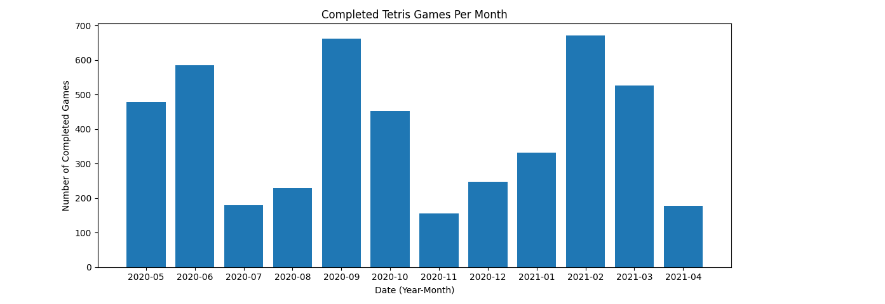
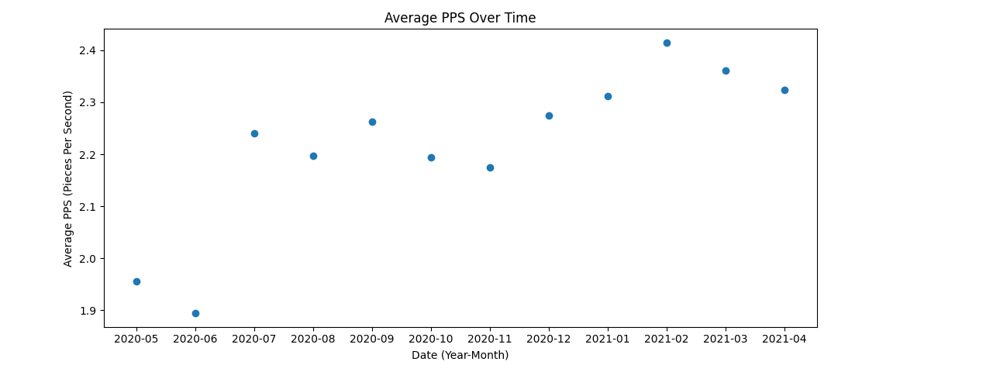
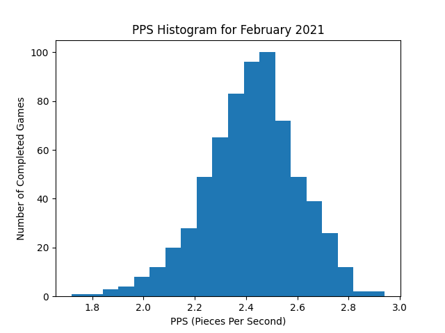
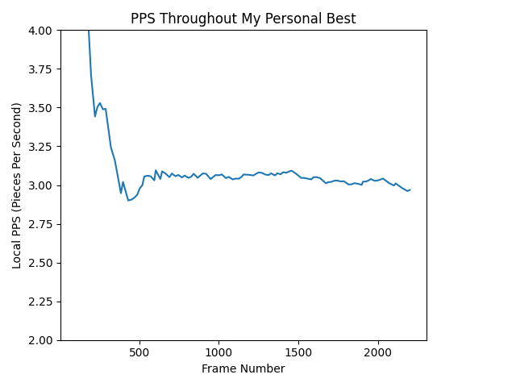

# tetris-stats
Tracking different tetris stats via NullpoMino replay files

## example stats results

Here are some graphs generated using my tetris stats parsing. All of them have
been generated from my personal replay files.

I play NullpoMino 40 Line Sprint almost exclusively, so all data shown here is
from tetris games with the goal of clearing 40 lines as quickly as possible.

Here is an overview on the number of games I've played per month in the past
year. I have some data from before May 2020, but most of it was deleted.
This is the only continuous interval of time I have.
Each counted game has to be completely finished to be tracked; 
if I hit "retry" before finishing, it is not tracked.

Here are two graphs showing my average PPS (Pieces Per Second) for each month.
Only top 25% (by PPS) of finished games were considered in the average. This
eliminates all games where I left and then lost while away, and other 
uninteresting scenarios.

This is a histogram of my scores from the month of February, 2021. I had a lot
of high scores in that month, so I was interested in seeing how the games
broke down overall.

Here is a plot of the PPS over time of my current personal best game. This
is not the exact PPS, but it approximates the game's value to two decimals.

As you can see in the plot, my PPS is extremely high at the start of the game.
This is typically the case with 40 Line Sprint games. In these games,
you get a pre-game countdown to get ready to play, and then can immediately
start making moves. Your first move is typically as close to the first
playable frame as possible. You can plan up to six moves in advance
based on piece previews prior to starting.

You can see my fight to stay above 3 PPS, a milestone I hope to reach
soon. I ended with 2.9415, and have no other games with a higher PPS.

[Here](https://www.youtube.com/watch?v=lYA9-c78J-A) is a link to a video of the
game being analyzed above.
