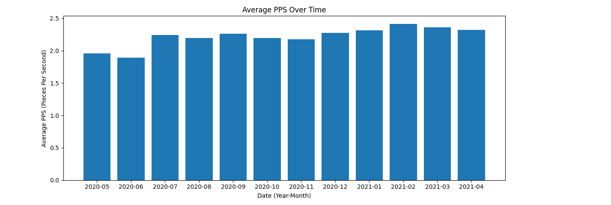
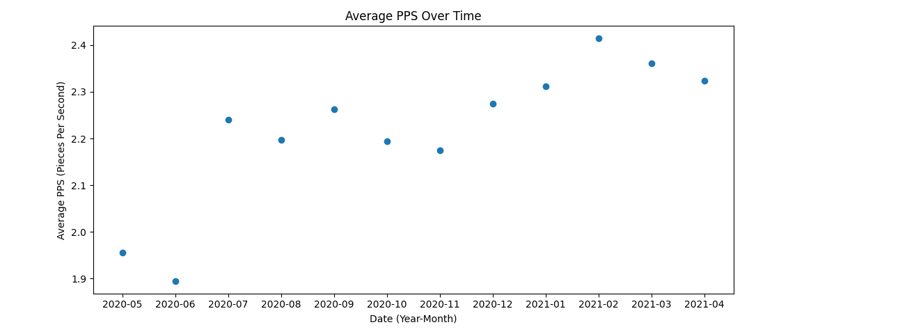

# tetris-stats
Tracking different tetris stats vial NullpoMino replay files

## example stats results

Here are some graphs generated using my tetris stats parsing. All of them have
been generated from my personal replay files so fare.

Here is an overiview on the number of games I've played per month in the past
year. I have some data from before May 2020, but much of it was deleted to make
space, so this is the only continuous interval of time I have so far. Each
counted game has to be completely finished to be tracked; if I hit "restart"
before finishing, it is not tracked.

Here are two graphs showing my average PPS (Pieces Per Second) for each month.
Only the upper-quartile finished games were considered in the average. This
eliminates all games where I left and then died while away, and other 
uninteresting scenarios.

This is a histogram of my scores from the month of February, 2021. I had a lot
of high scores in that month, so I was interested in seeing how the games
broke down overall.

